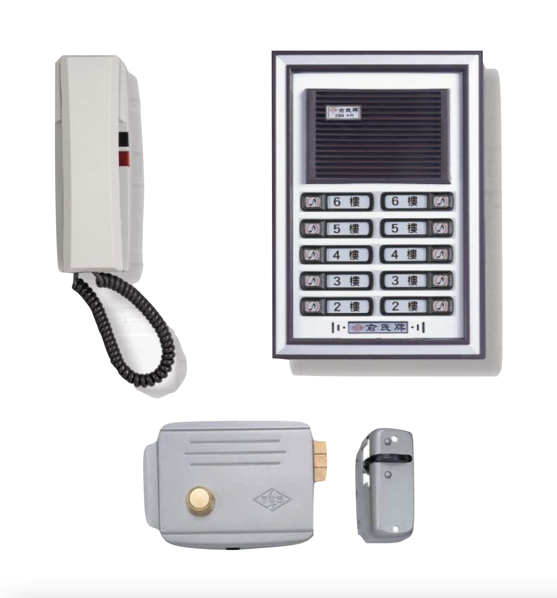

# electric_lock_control_esp8266

This is an Arduino program built for ESP8266 to control traditional electronic door locks w/ intercom, which are popular in apartments across Taiwan. It can be installed inside the intercom and provide an HTTP API and optional MQTT client over WiFi, which can be further integrated with chatbots, Home Assistant, and Apple HomeKit or Google Home, providing ease of opening the door or customized access control.



## Configurations

Copy `00_config.sample.ino` to `00_config.ino` and change it.

## Sample Installations

* https://hackmd.io/@z/sg202-elec-infra#%E9%9B%BB%E9%8E%96%E8%BD%89-HTTP-API--MQTT

## Integration Examples

### Home Assistant

(You would need to setup MQTT on Home Assistant)

```yaml
lock:
  - platform: mqtt
    name: 1F Door
    command_topic: "electric_lock_control_esp8266/command"
    state_topic: "electric_lock_control_esp8266/state"
```

See: https://www.home-assistant.io/integrations/lock.mqtt/
